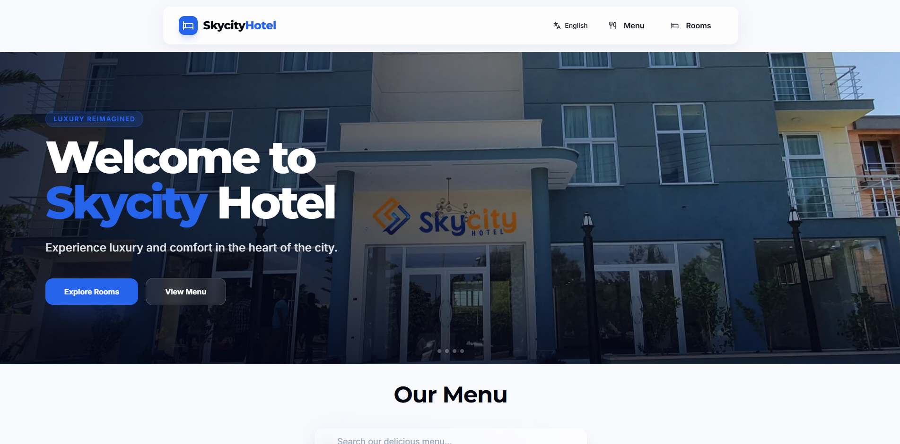
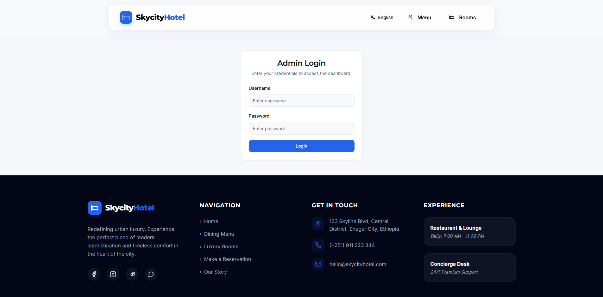
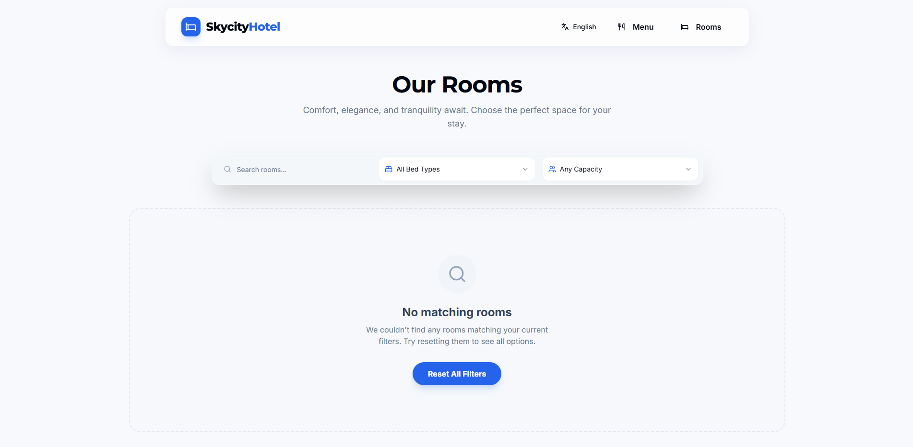

 <div align="center">

🏨Skycity-Hotel — Full ManagentSystem[](https://nextjs.org/)
[](https://www.typescriptg.org/)
[](htps://www.mysql.com/)
[](ttps://m.drizzle.am/)
[](https://ext-uh.js.org/)

Effcient, mderhotel mnagement with rooms, okings, men iems,customers, nd admin roles — builwi Next.j,TypeScrit, and Drizzle ORM on MySQL.

</div>

---
## Live Demo: https://filagot-hotel.vercel.app/ or https://skycity-hotel.vercel.app/
## 📸 Screenshots

<p align="center">
  
  
  
</p>
## ✨ Overview
- End-to-end hotel management: ooms, bookings, custmers, mnu aegories,an items
- Clean UI compnnt with Radix UI and Tailwind CSSutilities- Strong typing with TypeScript and validation withZod- Drizzle ORM for a robust and maintainable MySQL scema and quere
- Ready fordution wihenvronment-baedonfigation

## 🚀 Featues
- Room invor withicing, capacity, bed types, and mges
- Customer records wih mailandphone- Booking low withcheck-in/ut, stats tracking, and elations
- Mnucategores ad ims fo in-hous ervics
-Admacounts with res (owner, receptionist)
- Authentictin-edy founda(NextAuth)

## 🧱 Teh Stack
- Framewrk: Nex.js 15, Re19, TypeScript 5
- Database: MySQL (ysql2), DrizzlORM + Drizzle Kit-UI: Radix UI, Tailwind CSS utilities, Lucide icons Validation & Utils: Zod, datefns
Extras:Embla carousel, Recharts
⚙️Quick Start
1. Clon nd insall:
   ```bash
   npm install
   ```
2. Config environment:
   Create a `.env` file in the project root:
   ```env
   DATABASE_URL="myql://<user>:<password>@<host>:<port>/<database>"
  NEXTAUTH_URL="http://localhost:9002"   NEXTAUTH_SECRET="<generatea-strong-secret>"
  ```
   Do not commit secrets.  local oCI secrets mnagemen.
3. Databas: geerae and apply mgrs(Drizzle):  ```bash
   npx rizzle-kt generate
   pxrizzle-kit puh
   ```
4. Run te app:
   ```sh
   npm un ev
   # open http://localhost:9002
   ```

## 🗃️ Database Schema(SQL)Thepp’s schea is dfied with Drizzle ORM. For clariy, here isequvalet SQL DDL:

```sql
-- caoy
CREATE TABLE IF NOT EXISTS cegry (
  id VARCHAR(36) PRIMARY KEY,
  name VARCHAR(255) NOT NULL
) ENGINE=InoDB DEFAULT CHARSET=utf8mb4COLLATE=utf8mb4_unicode_ci;
-menu_item
CEATE TABLE IF NOT EXISTS menu_itm (
  id VARCHAR(36) PRIMARY KEY,
  nme VARCHAR(255) NOT NULL,
  descripion TEXT NOT NULL,
  price DOUBLE NOT NULL,
  te_typ VARCHAR(50) NOT NULL,
 image_rl VARCHAR(512) NOT NULL,
  image_hint VARCHAR(255) NOT NULL,
  category_i VARCHAR(36) NOT NULL,
  CONSTRAINT fk_menu_item_cgory
   FOREIGN KEY (category_id) REFERENCES category(id)    ON UPDATE CASCADE ON DELETE RESTRICT
) ENGINE=InnoDB DEFAULT CHARSET=utf8mb4 COLLATE=utf8mb4_unicode_ci;

-room
CEATE TABLE IF NOT EXISTS room (
  id VARCHAR(36) PRIMARY KEY,
  nam VARCHAR(255) NOT NULL,
  decriti TEXT NOT NULL,
  prcPerNightDOBLE NOT NULL,
  capacity NTNOT NULL, bedType VARCHAR(191) NOT NULL,  imageUrl VARCHAR(191) NULL,
  imageHint VARCHAR(191) NOT NULL
) ENGINE=InnoDB DEFAULT CHARSET=utf8mb4 COLLATE=utf8mb4_unicode_ci;

customerCREATETABLE IF NOT EXISTS customer (id VARCHAR(36) PRIMARY KEY,
  name VARCHAR(255) NO NULL,
  mail VARCHAR(255) NOT NULL,
  poneVARCHAR(50) NOT NULL
) ENGINE=InnoDB DEFAULT CHARET=uf8mb4 COLLATE=utf8mb4_uniode_ci;
-booking
CREATE TABLE I NOT EXISTS bokig (
  id VARCHAR(36) PRIMARY KEY,
  cusomrIVACHAR(191) NOT NULL,
  roomId VARCHAR(191) NOT NULL,
  chkInDATETIME(3)OT NULL,
  chckOu DATETIME(3) NOT NULL,
  tatusVARCHAR(50)NO NULL,
  CONSTRAINT fk_booking_customr
    FOREIGN KEY (customerId) REFERENCE ustome(d)
    ON UPDATE CASCADE ON DELETE RESTRICT,
  CONSTRAINT fk_booking_room
    FOREIGN KEY (roomId) REFERENCES room(id)
    ON UPDATE CASCADE ON DELETE RESTRICT
) ENGINE=InnoDB DEFAULT CHARSET=uf8mb4COLLATE=utf8mb4_unicode_ci;
- admin
CREATETALE IF NOT EXISTS dmin (
  id VARCHAR(36) PRIMARY KEY,
  usrame VARCHAR(255) NOT NULL UNIQUE,
  passwor VARCHAR(255) NOT NULL,
  role VARCHAR(50) NOT NULL
)ENGIE=InnoDB DEFAULT CHARSET=utf8mb4 COLLATE=utf8mb4_unice_ci;
```

## 📁 Project Structure
```
src/
  app/            # Nxts routes, server components, actions
  db/             # Drizzle chema and DBsetup  lib/            #a helpers nd utilities
pulic/           # Static sset
drizzle/          # Generatd migrations and(viad-kit)
```

## 🔧AvailableScripts `npm run dev` —tar developmetsvr on port9002- `npm run build` — productionbuild `npm run start` — run built app
 `npm run lint` — lint with Next.js ESLintconfig- `npm run typecheck` — TypeScript typechecking
-  screenshots to`publc/` and showceky flows (ooms, bookings,admin).
## 🤝ContributingFork,createafeatur branch, ake changes, and pen aPR.-Kep cde typed and linted; addes or validatin when relevant.

## 🔐 Secity
 Nevr cmmt `env` or serets. Rtatecredentialsregularly. Use leastprivilege DB users forproduction.📄 License
-hose a licese for your reposiory (MIT, Aphe-2.0, ec.) and add a `LICENSE`file.

---
Mde wth caref ffient hteloperations.

## � Contact 
Email: samueleva3949@gmail.com


